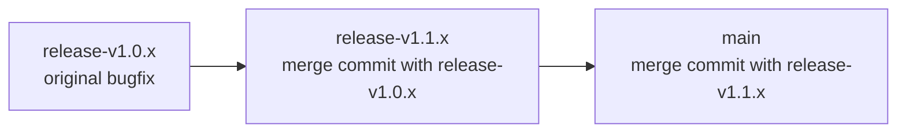

# Releasing

## Branching and Release Workflow

This repository maintains two major versions, supporting Spring Boot 3 and 4. The goal is to maintain both versions at
least until Spring Boot 3 reaches its end of life or becomes irrelevant.

| branch           | info                                       |
|------------------|--------------------------------------------|
| `main`           | version `2.x` supporting Spring Boot `4.x` |
| `release-v1.*.x` | version `1.x` supporting Spring Boot `3.x` |

Bugfixes for `1.x` should be merged into the lowest applicable `1.x` release branch. From there, they are cascaded
forward into newer version branches if applicable, so fixes propagate through the release line without being duplicated
unnecessarily.

Following diagram demonstrates the merge direction that comes from `release-v1.0.x` up to `main`.



**Note** that the `1.x` major version is supported, but older minor release lines may not be maintained long-term. Bug
fixes are applied only when necessary, and maintenance typically focuses on the more recent `1.*.x` branches unless an
issue is critical or a change can be backported with minimal effort.

## Sonatype Snapshots

[](https://github.com/malczuuu/problem4j-spring/actions/workflows/gradle-publish-snapshot.yml)


See [`gradle-publish-snapshot.yml`](.github/workflows/gradle-publish-snapshot.yml) for publishing snapshot version
instructions. Workflow requires manual trigger for snapshot build so it's not published regularly.

Artifacts are published to Snapshot Repository, using following Gradle task.

```bash
./gradlew -Pversion=<version> publishAggregationToCentralPortalSnapshots
```

### Accessing packages from Sonatype Snapshots

1. Maven:
   ```xml
   <repositories>
       <repository>
           <id>maven-central</id>
           <url>https://repo.maven.apache.org/maven2/</url>
       </repository>
       <repository> <!-- add snapshot repository (for unpublished or nightly builds) -->
           <id>sonatype-snapshots</id>
           <url>https://central.sonatype.com/repository/maven-snapshots/</url>
           <releases>
               <enabled>false</enabled>
           </releases>
           <snapshots>
               <enabled>true</enabled>
               <updatePolicy>always</updatePolicy> <!-- always check for new snapshots -->
           </snapshots>
       </repository>
   </repositories>
   <dependencies>
   <dependency>
       <groupId>io.github.malczuuu.problem4j</groupId>
       <artifactId>problem4j-spring-webflux</artifactId>
       <version>{snapshot}</version>
   </dependency>
   <dependency>
       <groupId>io.github.malczuuu.problem4j</groupId>
       <artifactId>problem4j-spring-webmvc</artifactId>
       <version>{snapshot}</version>
   </dependency>
   </dependencies>
   ```
2. Gradle (Kotlin DSL):
   ```kotlin
   repositories {
       mavenCentral()
       maven { // add snapshot repository (for unpublished or nightly builds)
           url = uri("https://central.sonatype.com/repository/maven-snapshots/")
           content {
               // only include snapshots from this group to avoid conflicts
               includeGroup("io.github.malczuuu.problem4j")
           }
           mavenContent {
               snapshotsOnly()
           }
       }
   }
   // always refresh "changing" dependencies (e.g., SNAPSHOT versions)
   configurations.all {
       resolutionStrategy.cacheChangingModulesFor(0, TimeUnit.SECONDS)
   }
   dependencies {
       implementation("io.github.malczuuu.problem4j:problem4j-spring-webflux:{snapshot}") {
           isChanging = true // ensures Gradle re-checks for new snapshot versions
       }
       implementation("io.github.malczuuu.problem4j:problem4j-spring-webmvc:{snapshot}") {
           isChanging = true // ensures Gradle re-checks for new snapshot versions
       }
   }
   ```

## Maven Central

[](https://github.com/malczuuu/problem4j-spring/actions/workflows/gradle-publish-release.yml)
[][maven-central]

1. Keep Git tags with `vX.Y.Z-suffix` format. GitHub Actions job will only trigger on such tags and will remove `v`
   prefix.
2. After publishing a release, update [`next_version.txt`](.github/utils/next_version.txt) for snapshot builds
   automation.
3. The releasing procedure only uploads the artifacts to Sonatype repository. You need to manually log in to Sonatype to
   push the artifacts to Maven Central.

See [`gradle-publish-release.yml`](.github/workflows/gradle-publish-release.yml) for publishing release versions
instructions.

Set the following environment variables in your CI/CD (GitHub Actions, etc.):

```txt
# generated tokens on Sonatype account, do not use real username/password
PUBLISHING_USERNAME=<username>
PUBLISHING_PASSWORD=<password>

# generated PGP key for signing artifacts
SIGNING_KEY=<PGP key>
SIGNING_PASSWORD=<PGP password>
```

Artifacts are published to Maven Central via Sonatype, using following Gradle task.

```bash
./gradlew -Pversion=<version> -Psign publishAggregationToCentralPortal
```

This command uses `nmcp` Gradle plugin - [link](https://github.com/GradleUp/nmcp).

[maven-central]: https://central.sonatype.com/namespace/io.github.malczuuu.problem4j
